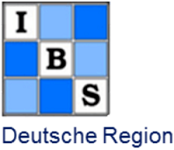

<style type="text/css">
h1.title {
  display: none;
}
</style>

<style type="text/css">
.subtitle {
  font-size: 36px;
  color: DarkRed;
  text-align: center;
}
</style>

<style type="text/css">
  body{
  font-size: 12pt;
}
</style> 

<style>
.sponsor {
  display: inline-block;
  margin: 10px;
}

.sponsor img {
  max-width: 100%;
  height: auto;
}

.organizers {
  text-align: center;
  margin-bottom: 30px;
  background-color: #ADD8E6 
}

</style>

```{=html}
<head>
<title>ADMTP2025</title>
</head>
```


```{r echo=FALSE}
# https://stackoverflow.com/questions/61313078/create-a-carousel-in-rmarkdown
objpath <- file.path(getwd(),"images/carousel_home")
slickR::slickR(
    list.files(objpath,full.names = TRUE,pattern = 'jpg'),
    height = 250,
    width = '95%')
```


<br>

We are delighted to announce the next annual workshop of the joint working group “Adaptive Designs and Multiple Testing Procedures” of the German (DR) and the Austrian-Swiss (ROeS) Regions of the International Biometric Society (IBS).

**Where:** Regensburg, Germany (in-person only).

**When:** The workshop will run from 26th-27th February 2025.

<!-- **Invited Speakers:** We are delighted to announce that **Prof. XXX** (University of XXX) and **Dr. XXX** (XXX) will present as invited speakers. The workshop will also feature an invited session on XXX. -->


**Short course:** There will be a pre-workshop short course on *Bayesian Adaptive Trials* from 24th-25th February 2025. 

**Abstract submission:** Submission of abstracts will close on 3rd November 2024 (see this [**link**](https://admtp.github.io/ADMTP2025/abstract.html)).

**Registration:** Details TBC.

**Scientific and Organising Committee:** David Robertson (MRC Biostatistics Unit, University of Cambridge), Thomas Jaki (University of Regensburg and MRC Biostatistics Unit, University of Cambridge), Cornelia Kunz (Boehringer-Ingelheim), Marta Bofill Roig (Medical University of Vienna).

**Contact:** If you have any questions about the workshop, please e-mail [David Robertson](mailto:david.robertson@mrc-bsu.cam.ac.uk).


$$\\[0.1cm]$$

### Organizers

<hr>

```{=html}
<div class="organizers">
    <div class="sponsor">
        <a href="https://www.ibs-roes.org/"; target=_blank">
        
        </a>
    </div>
    <div class="sponsor">
        <a href="http://www.biometrische-gesellschaft.de/en/home.html"; target=_blank">
        
        </a>
    </div>
    <div class="sponsor">
        <a href="https://www.uni-regensburg.de/en"; target=_blank">
        
        </a>
    </div>
    <div class="sponsor">
        <a href="https://www.uni-regensburg.de/informatics-data-science/faculty/home/index.html"; target=_blank">
        
        </a>
    </div>
</div>
```
