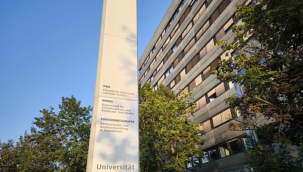

<!-- <style type="text/css"> -->

<!-- body { -->

<!--  background-image: url("coming_soon.jpg"); -->

<!--  background-position: center top; -->

<!--  background-size: 100% auto; -->

<!-- } -->

<!-- </style>  -->

```{=html}
<style type="text/css">
h1.title {
  font-size: 36px;
  color: DarkRed;
  text-align: center;
}
</style>
```

<br/>


<style type="text/css">
    #venue {
        display: block;
        margin-left: auto;
        margin-right: auto }
</style>

<br/>

<b>
Room H401<br>
Faculty of Informatics and Data Science<br>
Bajuwarenstraße 4<br>
93053 Regensburg<br>
Germany
</b>
 